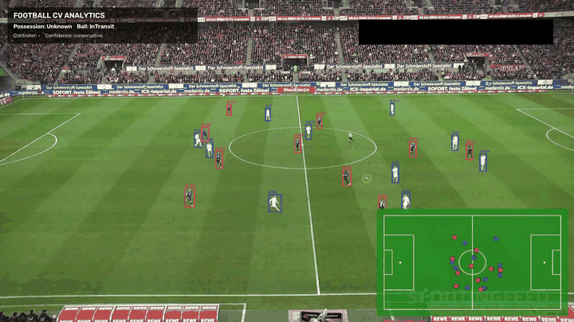

# Football CV Analytics

An end-to-end computer vision pipeline that converts football match video into player/ball tracks, pitch coordinates, possession states, football events, and team-level tactical metrics.

The pipeline separates tracking, trajectory cleaning, possession reasoning, event extraction, and tactical analysis into independently testable stages.

## Demo

<p align="center">
  
</p>

[Watch the full 30-second demo (MP4)](https://github.com/samuehuang/football-cv-analytics/releases/download/v4.1.0/football_cv_analytics_demo_full_30s.mp4)

## Results and Validation

| Team shape | Compactness over time |
| --- | --- |
|  |  |

Results below come from **one validated sample video**. They describe pipeline outputs and regression consistency, not standardized accuracy benchmarks.

| Output | Validated sample |
| --- | --- |
| Player observations | 15,377 raw → 14,845 cleaned; 22 tracked IDs |
| Trusted ball coverage | 635 / 750 frames (84.7%) |
| Possession output | 747 frames |
| Detected events | 43: possession episodes, dribbles, receptions, passes, aerial duel, and air touch |
| Complete 10v10 tactical coverage | Strict: 323 / 747 (43.2%); identity-aware: 405 / 747 (54.2%) |

High-confidence team-assignment correction recovered **82 additional complete tactical frames**. Team and inter-team metrics matched exactly on all **323 shared frames** (`max_diff = 0.0`). The main tracking, ball, possession, and event stages also passed exact regression checks during package restructuring.

Identity-aware processing corrects team-assignment inconsistencies for team-level analysis; it does not establish physical player identity.

## How It Works

**Video → player tracking → trajectory cleaning → ball tracking → possession and ball state → events → optional tactical analytics**

| Module | Purpose | Implementation |
| --- | --- | --- |
| Player tracking | Detection, team assignment, pitch projection, and trajectory cleaning | [Tracking](src/player/tracking.py), [cleaning](src/player/trajectory.py) |
| Ball tracking | Raw detections and trusted trajectories from multiple detection signals | [Ball](src/ball/tracking.py) |
| Possession | Separate controller, possession, last touch, and ball motion | [Possession](src/possession/) |
| Events | Extract possession episodes, passes, receptions, dribbles, and aerial interactions | [Engine](src/events/engine.py), [QA](src/events/qa.py) |
| Tactical analytics | Identity QA, strict/identity-aware datasets, team shape, and opponent spacing | [Analytics](src/analytics/) |

A ball in transit does not automatically imply a possession change. Tactical metrics include team centroid, width, length, compactness, shape area, inter-team distance, and nearest-opponent spacing.

## Quick Start

Validated development environment: **Python 3.9.6**. Run from the repository root.

```bash
python3 -m venv .venv
source .venv/bin/activate
python -m pip install --upgrade pip
python -m pip install -r requirements.txt
python -m pip check
python scripts/smoke_test.py
```

The smoke test checks dependencies, source compilation, CLI interfaces, and sample schemas without model weights or input video. It does not run inference; a successful check ends with `SMOKE TEST: PASS`.

To run inference, place the required weights under `models/` as specified in [configs/default.yaml](configs/default.yaml), and supply a match video:

```bash
python run_pipeline.py --video videos/match.mp4 --run-name my_match
python run_analytics.py --run-dir runs/my_match
```

Outputs are stored under `runs/my_match/`, with tactical results under `analytics/outputs/`. Device selection defaults to `auto`; Apple Silicon users can explicitly request `--device mps` for the main pipeline. See `python run_pipeline.py --help` and `python run_analytics.py --help` for other options.

## Sample Outputs and Documentation

Inspect representative outputs without running inference:

| Sample | Contents |
| --- | --- |
| [tracking_sample.csv](examples/sample_outputs/tracking_sample.csv) | Cleaned player tracks, image/pitch coordinates, and speed fields |
| [football_events.csv](examples/sample_outputs/football_events.csv) | Event-engine output for the validated sample |
| [tactical_coverage_comparison.csv](examples/sample_outputs/tactical_coverage_comparison.csv) | Strict versus identity-aware frame coverage |
| [team_tactical_metrics_summary_identity_aware.csv](examples/sample_outputs/team_tactical_metrics_summary_identity_aware.csv) | Team centroid, dimensions, compactness, and shape-area statistics |

- [Pipeline reference](docs/pipeline_reference.md): component details, event counts, CLI options, output structure, configuration, and regression checks.
- [Development roadmap](docs/roadmap.md): planned report questions, evidence requirements, and release criteria.

## Limitations

- Tracking IDs are not verified physical player identities; identity-aware corrections apply only to high-confidence team assignments.
- Current tactical analysis focuses on team geometry and spatial relationships, validated on one sample video.
- The reported figures measure coverage and regression consistency; event and tactical accuracy require further evaluation.
- Model weights and input videos are excluded from the repository.

## Roadmap

These are **planned milestones**, not implemented features. Version numbers are proposed targets, subject to validation and data availability.

| Target | Planned scope |
| --- | --- |
| v5.0.0 | Deterministic Coach Report V1: rule-based observations and JSON/Markdown reports linked to frames, metrics, and events |
| v5.1.0 | FastAPI/Pydantic reporting API and optional LLM wording of verified observations |
| v6.0.0 | Multi-match comparisons and evidence retrieval; RAG/scouting exploration when sufficient validated data exists |

Start with the deterministic report. Numerical analysis remains in code; LLMs may assist presentation, and player-level comparisons require verified identity mapping. See the [full roadmap](docs/roadmap.md).

## License

Released under the [MIT License](LICENSE). Model weights, input videos, datasets, and third-party dependencies remain subject to their respective licenses and terms.
