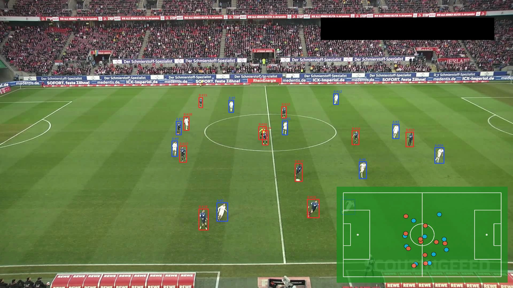
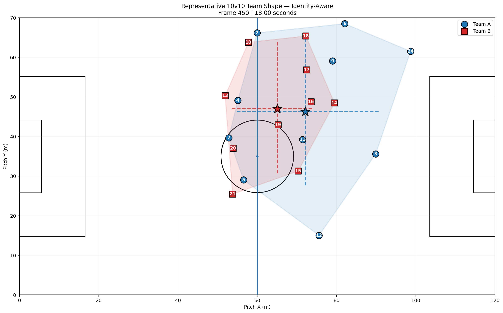
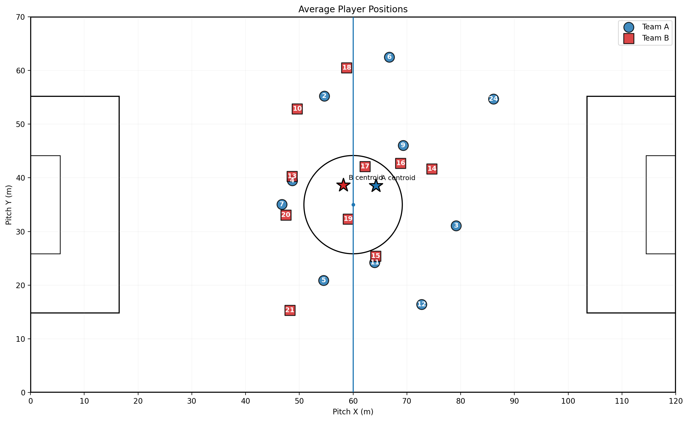
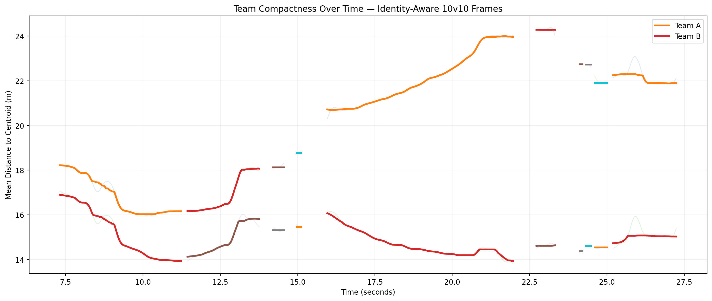

# Football CV Analytics

An end-to-end computer vision pipeline for converting football match video into structured player tracking, ball tracking, possession states, football events, and team-level tactical analytics.

The project is designed as a modular pipeline rather than a single inference script. It separates player tracking, trajectory cleaning, ball tracking, possession reasoning, event extraction, identity quality control, and tactical analysis into independently testable stages.

---

## Results at a Glance

### End-to-End Football Tracking

<p align="center">
  
</p>

<p align="center">
  <em>Video-based player tracking with pitch projection and radar visualization.</em>
</p>

### Tactical Analytics

| Identity-Aware Team Shape | Average Positions |
| --- | --- |
|  |  |
| Representative 10v10 team structure after high-confidence team-assignment correction. | Spatial summary of player positioning on the pitch. |

<p align="center">
  
</p>

<p align="center">
  <em>Identity-aware team compactness over time for temporal tactical analysis.</em>
</p>

The full pipeline connects computer vision and football analytics:

**video → player tracking → trajectory cleaning → ball tracking → possession reasoning → event extraction → tactical analysis**

> Identity-aware analytics only corrects high-confidence team-assignment inconsistencies for team-level analysis. It does not claim recovery of physical player identity.

---

## Overview

Given a football match video, the pipeline produces:

- Player detection and tracking
- Pitch-projected player trajectories
- Cleaned player trajectories
- Ball tracking
- Possession and ball-motion states
- Football events
- Quality-assurance outputs
- Team-level tactical analytics

The project contains two main entry points:

```text
run_pipeline.py
run_analytics.py
```

`run_pipeline.py` performs the canonical football computer-vision pipeline.

`run_analytics.py` performs optional downstream tactical analysis using the cleaned player tracking data.

---

## Pipeline

```text
Football Video
      │
      ▼
Player Tracking
      │
      ▼
Trajectory Cleaning
      │
      ▼
Ball Tracking
      │
      ▼
Possession / Ball State
      │
      ▼
Football Event Engine
      │
      ▼
Canonical Outputs
      │
      ▼
Optional Tactical Analytics
      │
      ├── Identity QA
      │
      ├── Strict Tactical Dataset
      │
      └── Identity-Aware Tactical Dataset
              │
              ├── Team Tactical Metrics
              ├── Inter-Team Spatial Metrics
              ├── Team Shape Over Time
              └── Representative Team Shape Snapshot
```

---

## Core Components

### Player Tracking

The player pipeline performs:

- Player detection
- Team assignment
- Player tracking
- Pitch projection
- Track generation

Canonical implementation:

```text
src/player/tracking.py
```

---

### Trajectory Cleaning

The trajectory stage removes implausible motion and smooths player trajectories.

Canonical implementation:

```text
src/player/trajectory.py
```

Validated sample:

```text
14,845 cleaned player observations
22 tracked player IDs
```

---

### Ball Tracking

Canonical implementation:

```text
src/ball/tracking.py
```

The ball pipeline combines multiple ball-detection signals and produces both raw and trusted ball trajectories.

Validated sample:

```text
Total video frames:       750
Raw accepted detections:  608
Trusted usable frames:    635
Trusted coverage:         84.7%
```

---

## Possession Reasoning

Possession inference is implemented as a multi-stage reasoning pipeline under:

```text
src/possession/
```

Main stages:

```text
seed.py
air_interaction.py
physical_event.py
controller_validation.py
refinement.py
motion.py
final.py
```

The system deliberately separates several related concepts:

```text
Controller
Possession
Last Touch
Ball Motion
```

For example, a ball being in transit does not automatically imply that possession has changed.

This distinction helps reduce false turnovers and improves downstream event interpretation.

---

## Football Event Engine

Canonical implementation:

```text
src/events/engine.py
```

Quality assurance:

```text
src/events/qa.py
```

On the validated sample, the event engine produced:

```text
43 total events

28 PossessionEpisode
 6 Dribble
 4 Reception
 3 Pass
 1 AerialDuel
 1 AirTouch
```

---

## Tactical Analytics

Optional tactical analytics are implemented under:

```text
src/analytics/
```

The analytics pipeline operates on cleaned player tracking data generated by the canonical pipeline.

It includes:

- Player metrics
- Identity QA
- Strict tactical dataset construction
- Identity-aware tactical dataset construction
- Team tactical metrics
- Inter-team spatial metrics
- Team-shape visualization
- Representative tactical snapshots

---

## Identity QA

Tracking systems may occasionally maintain a trajectory while changing the assigned team label.

The project therefore includes:

```text
src/analytics/identity_qa.py
```

The identity QA stage detects persistent team-label transitions and searches for reciprocal transitions between tracks.

In the validated sample:

```text
Persistent team-label transitions: 2
High-confidence reciprocal pairs:  1
```

The detected pair involved:

```text
Track 7
Track 20
```

This is interpreted as a high-confidence probable reciprocal tracking/team-assignment switch.

It is **not** treated as proof that the physical identities of the players were recovered.

---

## Strict vs Identity-Aware Tactical Data

The strict tactical dataset keeps complete 10v10 frames that satisfy the original stable team-assignment rules.

Validated sample:

```text
Total frames:              747

Strict tactical frames:    323
Strict coverage:           43.2%

Identity-aware frames:     405
Identity-aware coverage:   54.2%

Recovered frames:           82
Recovered frame range: 568–681
```

The identity-aware branch uses high-confidence team-assignment corrections to recover additional complete 10v10 frames.

It is intended for:

```text
team-level tactical analytics
```

It is not intended for:

```text
physical player identity recovery
player-level identity claims
```

---

## Team Tactical Metrics

The project computes team-level geometry including:

- Team centroid
- Team length
- Team width
- Compactness
- Team shape area

Two parallel versions are produced:

```text
Strict
Identity-aware
```

The identity-aware implementation reuses the same canonical metric computation and changes only the input and output paths.

This ensures that both branches use the same formulas.

---

## Inter-Team Spatial Metrics

The project also measures the spatial relationship between the two teams.

Metrics include:

- Distance between team centroids
- Convex hull area
- Convex hull area difference
- Team footprint ratio
- Mean nearest-opponent distance
- Median nearest-opponent distance
- Minimum inter-team distance

Both strict and identity-aware branches reuse the same canonical implementation.

---

## Team Shape Visualization

The analytics pipeline generates:

```text
Team length over time
Team width over time
Team compactness over time
Representative team shape snapshot
```

Both strict and identity-aware versions are available.

Rolling smoothing is calculated independently inside continuous observation segments so that smoothing does not cross missing-data gaps.

---

## Installation

The validated development environment uses Python 3.9.6.

Create and activate a virtual environment:

    python3 -m venv .venv
    source .venv/bin/activate

Upgrade pip:

    python -m pip install --upgrade pip

Install the validated Python dependencies:

    python -m pip install -r requirements.txt

Verify the environment:

    python -m pip check

The validated dependency set includes NumPy, Pandas, SciPy, Matplotlib, OpenCV, scikit-learn, PyTorch, Ultralytics, Supervision, Sports, and PyYAML.

> Model weights are not included in the repository. Place the required model files under `models/` before running the main pipeline.

---

## Quick Verification

After installing the dependencies, the repository can be checked without model weights or input video:

    python scripts/smoke_test.py

The smoke test verifies:

- Required repository files
- Direct Python dependencies
- Python source compilation
- Main pipeline CLI
- Analytics CLI
- Representative sample-output schemas

A successful check ends with:

    SMOKE TEST: PASS

This is a lightweight repository check and does not run model inference or the full video pipeline.

---

## Quick Start

### 1. Prepare Model Files

The default configuration expects:

```text
models/
├── football-player-detection.pt
├── football-pitch-detection.pt
├── football-ball-detection.pt
└── yolov8m_forzasys_soccer.pt
```

Model paths are configured in:

```text
configs/default.yaml
```

Model weights are intentionally excluded from Git.

---

### 2. Prepare an Input Video

Place the football video under:

```text
videos/
```

For example:

```text
videos/match.mp4
```

Input videos are also excluded from Git.

---

### 3. Run the Main Pipeline

```bash
python run_pipeline.py \
  --video videos/match.mp4 \
  --run-name my_match
```

The result will be stored under:

```text
runs/my_match/
```

Available options:

```text
--video VIDEO
--run-name RUN_NAME
--config CONFIG
--device DEVICE
--resume
--overwrite
--skip-qa
--dry-run
```

Example using Apple Silicon MPS:

```bash
python run_pipeline.py \
  --video videos/match.mp4 \
  --run-name my_match \
  --device mps
```

Example dry run:

```bash
python run_pipeline.py \
  --video videos/match.mp4 \
  --run-name my_match \
  --dry-run
```

---

### 4. Run Tactical Analytics

After the canonical pipeline finishes:

```bash
python run_analytics.py \
  --run-dir runs/my_match \
  --overwrite
```

The analytics pipeline automatically uses:

```text
runs/my_match/data/tracking_data_clean_v2.csv
```

A custom tracking file can also be provided:

```bash
python run_analytics.py \
  --run-dir runs/my_match \
  --tracking path/to/tracking_data_clean_v2.csv \
  --overwrite
```

Analytics dry run:

```bash
python run_analytics.py \
  --run-dir runs/my_match \
  --overwrite \
  --dry-run
```

---

## Sample Outputs

Small representative outputs are included under:

`examples/sample_outputs/`

These files allow the data structures produced by the pipeline to be inspected without running the full video pipeline.

| Output | Description |
| --- | --- |
| [tracking_sample.csv](examples/sample_outputs/tracking_sample.csv) | Small sample of cleaned player tracking with image coordinates, pitch coordinates, trajectory cleaning, and speed fields. |
| [football_events.csv](examples/sample_outputs/football_events.csv) | Complete event-engine output containing possession episodes, dribbles, receptions, passes, and other detected football events. |
| [tactical_coverage_comparison.csv](examples/sample_outputs/tactical_coverage_comparison.csv) | Comparison between strict and identity-aware complete 10v10 tactical coverage. |
| [team_tactical_metrics_summary_identity_aware.csv](examples/sample_outputs/team_tactical_metrics_summary_identity_aware.csv) | Team-level centroid, length, width, compactness, and shape-area statistics. |

For the validated sample:

- Strict tactical coverage: **323 / 747 frames (43.2%)**
- Identity-aware tactical coverage: **405 / 747 frames (54.2%)**
- Additional complete tactical frames recovered: **82**

The identity-aware outputs apply only high-confidence team-assignment corrections for team-level tactical analysis; they do not represent recovered physical player identities.

---

## Output Structure

Canonical runs are stored under:

```text
runs/<run-name>/
```

Typical structure:

```text
runs/<run-name>/
├── data/
├── json/
├── videos/
├── logs/
├── possession/
└── analytics/
    └── outputs/
```

The analytics pipeline generates both strict and identity-aware results.

Examples:

```text
tracking_data_tactical.csv
tracking_data_tactical_identity_aware.csv

team_tactical_metrics_frame_v2.csv
team_tactical_metrics_frame_identity_aware.csv

team_tactical_metrics_summary_v2.csv
team_tactical_metrics_summary_identity_aware.csv

inter_team_spatial_metrics_frame.csv
inter_team_spatial_metrics_frame_identity_aware.csv

inter_team_spatial_metrics_summary.csv
inter_team_spatial_metrics_summary_identity_aware.csv

team_length_over_time_v2.png
team_length_over_time_identity_aware.png

team_width_over_time_v2.png
team_width_over_time_identity_aware.png

team_compactness_over_time_v2.png
team_compactness_over_time_identity_aware.png

team_shape_snapshot.png
team_shape_snapshot_identity_aware.png
```

---

## Validation

The project was refactored only after establishing regression boundaries.

### Canonical Pipeline Regression

Validated sample:

```text
Player raw tracking
15,377 rows
EXACT PASS

Player cleaned tracking
14,845 rows
22 tracks
EXACT PASS

Ball raw
750 rows
EXACT PASS

Ball trusted
750 rows
EXACT PASS

Possession
747 frames
EXACT PASS

Football events
43 events
EXACT PASS
```

---

### Analytics Regression

Final analytics QA:

```text
Strict frames:          323
Identity-aware frames:  405
Recovered frames:        82
Recovered range:    568–681
```

For all frames shared by the strict and identity-aware branches:

```text
Team tactical metrics
max_diff = 0.0

Inter-team spatial metrics
max_diff = 0.0
```

This verifies that the identity-aware branch extends usable tactical coverage without altering the original strict measurements on common frames.

---

## Repository Structure

```text
.
├── configs/
│   └── default.yaml
│
├── src/
│   ├── player/
│   │   ├── tracking.py
│   │   └── trajectory.py
│   │
│   ├── ball/
│   │   └── tracking.py
│   │
│   ├── possession/
│   │   ├── seed.py
│   │   ├── air_interaction.py
│   │   ├── physical_event.py
│   │   ├── controller_validation.py
│   │   ├── refinement.py
│   │   ├── motion.py
│   │   └── final.py
│   │
│   ├── events/
│   │   ├── engine.py
│   │   └── qa.py
│   │
│   └── analytics/
│       ├── identity_qa.py
│       ├── player_metrics.py
│       ├── build_tactical_clean_dataset.py
│       ├── build_tactical_identity_aware_dataset.py
│       ├── team_tactical_metrics_v2.py
│       ├── team_tactical_metrics_identity_aware.py
│       ├── inter_team_spatial_metrics.py
│       ├── inter_team_spatial_metrics_identity_aware.py
│       ├── team_shape_over_time_v2.py
│       ├── team_shape_over_time_identity_aware.py
│       ├── team_shape_snapshot.py
│       └── team_shape_snapshot_identity_aware.py
│
├── legacy/
├── run_pipeline.py
├── run_analytics.py
└── run_pipeline_v4.py
```

---

## Canonical Entry Points

Recommended public entry points:

```text
run_pipeline.py
run_analytics.py
```

`run_pipeline_v4.py` is retained as a compatibility wrapper.

Several top-level CLI scripts under `src/` are also retained for backward compatibility.

Earlier experimental implementations are stored under:

```text
legacy/
```

They are not part of the recommended execution path.

---

## Configuration

Default configuration:

```text
configs/default.yaml
```

The configuration contains settings for:

```text
Model paths
Runtime device
Trajectory cleaning
Motion thresholds
Pipeline versions
```

Default runtime device:

```yaml
runtime:
  device: auto
```

This can be overridden using:

```text
--device
```

---

## Design Principles

This project follows several engineering principles:

1. Validated algorithms were frozen before major package restructuring.
2. Refactoring was separated from algorithm changes.
3. Exact regression checks were used when moving canonical implementations.
4. Strict and identity-aware analytics reuse the same metric implementations.
5. Identity-aware team corrections are not interpreted as physical player identity recovery.
6. Runtime outputs, model weights, videos, and large generated files are excluded from Git.

---

## Git-Ignored Files

The following are intentionally excluded from version control:

```text
.venv/
models/
videos/
outputs/
runs/
*.pt
*.pth
*.onnx
*.engine
*.mp4
*.log
```

---

## Limitations

The current system has several important limitations.

- Tracking IDs should not be interpreted as verified physical player identities.
- Identity-aware analytics corrects high-confidence team-assignment inconsistencies only.
- Tactical analytics currently focuses on team-level geometry and spatial structure.
- Quantitative values shown in this README come from one validated sample video.
- These values are regression checks, not standardized benchmark results.
- Model weights are not included in the repository.

---

## Development History

Earlier experimental implementations are retained under:

```text
legacy/
```

The canonical pipeline was promoted only after exact regression validation.

This allows the current implementation to remain stable while preserving the development history for reference.

---

## Current Status

Completed:

```text
Player tracking
Trajectory cleaning
Ball tracking
Possession reasoning
Ball-motion reasoning
Football event extraction
Event QA
Identity QA
Strict tactical analytics
Identity-aware tactical analytics
Regression validation
Repository package restructuring
```

Remaining repository work:

```text
Dependency packaging
Installation instructions
Example assets
Docker support
Final GitHub presentation
```

---

## License

This project is released under the [MIT License](LICENSE).

Model weights, input videos, datasets, and third-party dependencies are not distributed as part of this repository and remain subject to their respective licenses and terms.

---

## Project Status

The core computer-vision and tactical analytics pipeline is complete and regression-tested.

Current work focuses on packaging the project for reproducible public use, including dependency management, installation instructions, example assets, Docker support, and final GitHub documentation.